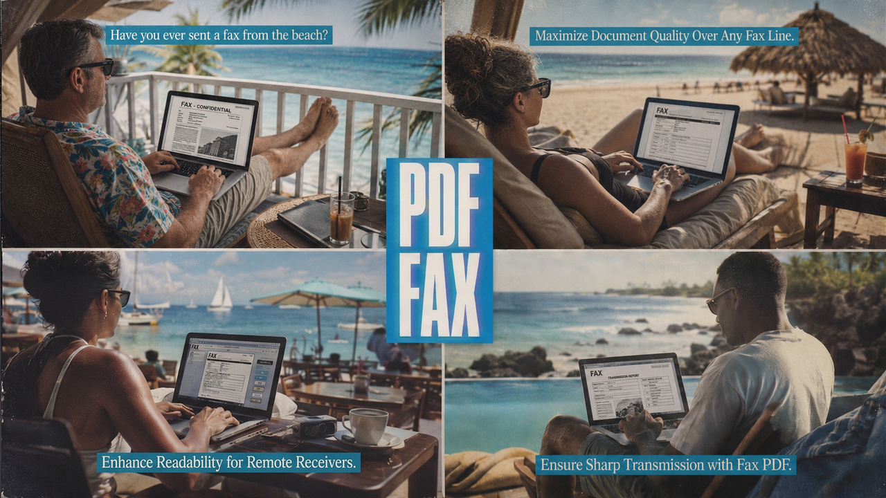

<p align="center">
  
</p>

# PDF Fax Optimizer — an Agent Skill

A portable [Agent Skill](https://www.anthropic.com/news/skills) that teaches an
AI coding agent to **maximize document quality and readability when sending a
PDF over a fax network.** It converts a PDF into a fax-native **1-bit bilevel
CCITT-G4** PDF (or Class-F multipage TIFF) that survives the lossy Group-3
transmission and **arrives legible on the receiving machine.**

> **A fax's whole job is to be READ.** That is the single most important thing
> about this skill. Fax transmission is low-resolution, 1-bit, and lossy by
> design over a noisy phone line, so this skill optimizes for **legibility on
> the other end first** — crisp text, intact small fonts and signatures,
> recognizable photos. Smaller files and faster transmission are welcome side
> effects, never the goal: a tiny fax that arrives unreadable is a failure.

> **Just need to shrink a PDF for email or the web?** That's a different job with
> the opposite trade-offs — use the companion skill:
> **[pdf-email-optimizer](https://github.com/petehottelet/pdf-email-optimizer)**.

To make a fax legible, the skill models the Group-3 constraint (1-bit,
anisotropic resolution, run-length compression along each scanline) and does
MRC-lite segmentation — crisp hard-thresholded text, halftoned photos — instead
of dithering the whole page into mud. It defends fine detail (background flatten,
despeckle, deskew, optional stroke thickening), warns about content that won't
survive bilevel, and lets you **preview exactly what will be transmitted** so
you can confirm it's readable before sending.

The `SKILL.md` format is an open standard. This skill is built and tested for
**Claude** (Claude Code / claude.ai) and **OpenAI Codex**.

## What it does

- Rasterizes each page at a fax-native resolution (`standard` 204×98, `fine`
  204×196, `superfine` 204×391), resampling axes independently and clamping the
  scanline to 1728 px.
- MRC-lite segmentation using the PDF's embedded-image rectangles: text/line-art
  → hard threshold; photos → halftone.
- Pre-cleans: background flatten, despeckle, deskew; optional stroke thickening
  to save hairlines and small fonts.
- Emits lossless CCITT-G4 (no re-encode) via img2pdf — a `CCITTFaxDecode` PDF or
  a Class-F multipage TIFF.
- Produces a JSON report with **estimated transmission time per page** and
  legibility/inversion warnings, plus a `--preview-page` PNG of exactly what
  will be transmitted.

## Halftone methods + the "eye tokens" comparison preview

A continuous-tone photo can't exist in 1-bit fax — it has to be simulated with
dot patterns, and that choice is the biggest lever on how a photo reads after a
lossy transmission. The skill ships the **top 5 halftoning technologies**,
spanning the design space:

| `--dither` | Family | Detail | G4 size | Noise robustness |
|---|---|---|---|---|
| `clustered` | AM screening (clustered-dot) | low–med | **best** | **best** |
| `blue-noise` | FM screening (void-and-cluster) | **high** | medium | medium |
| `atkinson` | error diffusion (6/8) | high | med | low–med |
| `floyd` | error diffusion | **highest** | **worst** | **worst** |
| `ordered` | ordered (Bayer) | medium | medium | medium |

(`jarvis`, `stucki`, `sierra`, and `none`/threshold are also selectable.)

Compression can be ranked by a machine, but **readability can't** — only a human
eye can decide whether a halftone "reads." So `--compare-page N` renders one page
through all five methods into a single labeled **contact sheet**, each panel
annotated with its real G4 size and transmission estimate, with the recommended
pick highlighted. The skill **suggests the optimal** method from the page's
content, and you **choose the optimal** by spending your *eye tokens* on the
contact sheet — then re-run with the chosen `--dither` for the final file.

```bash
python pdf-optimizer/scripts/optimize_pdf.py input.pdf -o output.fax.pdf \
    --fax-resolution fine --compare-page 1
# -> writes output.fax.compare_p1.png (a side-by-side of all 5 methods)
```

## Repository layout

```
.
├── README.md              # this file (for humans)
├── LICENSE                # MIT
├── requirements.txt       # Python deps
└── pdf-optimizer/         # the skill (this folder IS the skill)
    ├── SKILL.md           # entry point: metadata + instructions
    ├── agents/
    │   └── openai.yaml     # optional Codex UI sidecar
    ├── assets/
    │   └── bluenoise_64.npy # cached void-and-cluster blue-noise matrix
    ├── scripts/
    │   ├── check_deps.py   # verify/install dependencies
    │   ├── optimize_pdf.py # CLI entry point
    │   └── fax_pipeline.py # the fax conversion pipeline
    └── references/
        ├── fax-optimization.md  # the Group-3 model + why each knob exists
        └── config-schema.md     # JSON config schema + examples
```

## Requirements

- **Python 3.9+** with: PyMuPDF, Pillow, numpy, opencv-python-headless, img2pdf
  (`pip install -r requirements.txt`).
- **No CLI tools required.** (qpdf / Ghostscript are optional and only useful for
  unrelated PDF work.)

Let the skill bootstrap the Python side:

```bash
python pdf-optimizer/scripts/check_deps.py   # installs missing pip deps
```

## Installing the skill

`SKILL.md` is the open standard; the only difference between agents is **where**
the skill folder lives. Copy the `pdf-optimizer/` folder into the appropriate
location:

| Agent | Location (user-level) | Location (project-level) |
|---|---|---|
| **Claude Code** | `~/.claude/skills/pdf-optimizer/` | `.claude/skills/pdf-optimizer/` |
| **OpenAI Codex** | `~/.codex/skills/pdf-optimizer/` | `.agents/skills/pdf-optimizer/` |

```bash
git clone https://github.com/petehottelet/PDF-fax-optimizer.git
# Claude Code
cp -r PDF-fax-optimizer/pdf-optimizer ~/.claude/skills/pdf-optimizer
# OpenAI Codex
cp -r PDF-fax-optimizer/pdf-optimizer ~/.codex/skills/pdf-optimizer
```

**Claude Code** discovers skills automatically (no restart) and you can invoke
with `/pdf-optimizer`. For **claude.ai** (web/desktop), zip the `pdf-optimizer/`
folder so the folder is the archive root, then upload it under
Settings → Capabilities → Skills:

```bash
cd PDF-fax-optimizer && zip -r pdf-optimizer.zip pdf-optimizer
```

**OpenAI Codex** keeps skills behind an experimental flag — enable it once, then
restart Codex:

```toml
# ~/.codex/config.toml
skills = true
```

Codex activates the skill implicitly when your request matches the description,
or explicitly via `$pdf-optimizer`. (Codex caps the frontmatter `description` at
500 characters — this skill's description is within that limit.)

## Using it directly (without an agent)

The scripts are a normal CLI:

```bash
# Make a PDF faxable (1-bit CCITT-G4, fine resolution) + report + preview
python pdf-optimizer/scripts/optimize_pdf.py input.pdf -o output.fax.pdf \
    --fax-resolution fine --dither auto \
    --report output.report.json --preview-page 1

# Compare all 5 halftone methods on page 1 and pick by eye
python pdf-optimizer/scripts/optimize_pdf.py input.pdf -o output.fax.pdf \
    --fax-resolution fine --compare-page 1

# Multipage Class-F G4 TIFF instead of a PDF
python pdf-optimizer/scripts/optimize_pdf.py input.pdf -o output.tiff \
    --format tiff --fax-resolution fine
```

See `pdf-optimizer/references/config-schema.md` for the full flag/config
reference, and `pdf-optimizer/references/fax-optimization.md` for the reasoning
behind the fax defaults.

## License

MIT — see [LICENSE](LICENSE).
