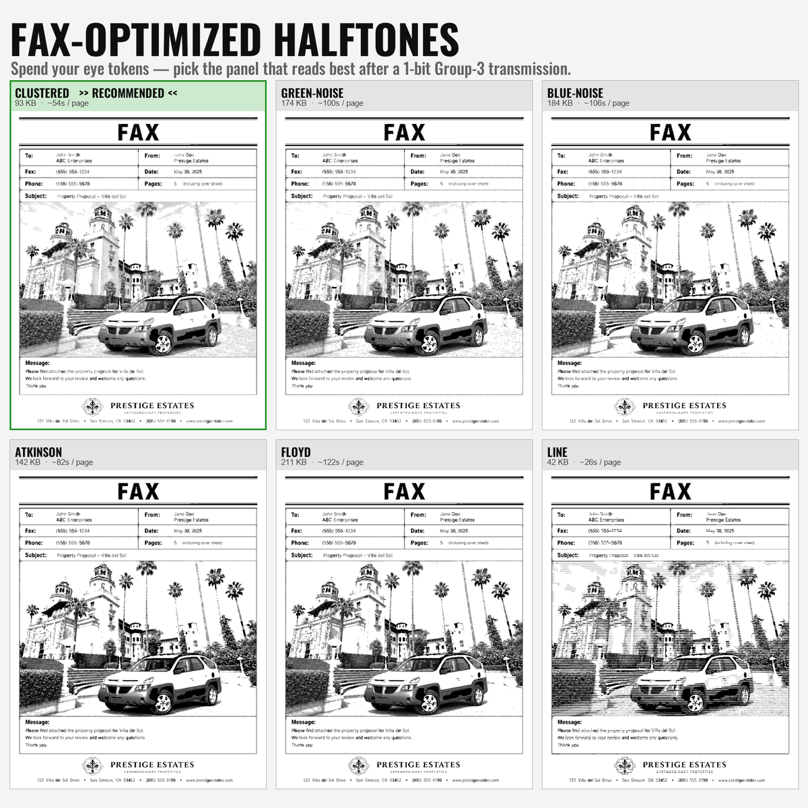

<p align="center">
  
</p>

# PDF FAX — an Agent Skill

A portable [Agent Skill](https://www.anthropic.com/news/skills) that teaches an
AI coding agent to **maximize document quality and readability when sending a
PDF over a fax network.** It converts a PDF into a fax-native **1-bit bilevel
CCITT-G4** PDF (or Class-F multipage TIFF) that survives the lossy Group-3
transmission and **arrives legible on the receiving machine.**

> **A fax's whole job is to be READ.** That is the single most important thing
> about this skill. Fax transmission is low-resolution, 1-bit, and lossy by
> design over a noisy phone line, so this skill optimizes for **legibility on
> the other end first** — crisp text, intact small fonts and signatures,
> recognizable photos. Smaller files and faster transmission are welcome side
> effects, never the goal: a tiny fax that arrives unreadable is a failure.

> **Just need to shrink a PDF for email or the web?** That's a different job with
> the opposite trade-offs — use the companion skill:
> **[pdf-email-optimizer](https://github.com/petehottelet/pdf-email-optimizer)**.

To make a fax legible, the skill models the Group-3 constraint (1-bit,
anisotropic resolution, run-length compression along each scanline) and does
MRC-lite segmentation — crisp hard-thresholded text, halftoned photos — instead
of dithering the whole page into mud. It defends fine detail (background flatten,
despeckle, deskew, optional stroke thickening), warns about content that won't
survive bilevel, and lets you **preview exactly what will be transmitted** so
you can confirm it's readable before sending.

The `SKILL.md` format is an open standard. This skill is built and tested for
**Claude** (Claude Code / claude.ai) and **OpenAI Codex**.

## What it does

- Accepts **PDF, Word, PowerPoint, Excel, OpenDocument, text, and image** input,
  normalizing non-PDF formats to PDF first (see *Input formats* below).
- Rasterizes each page at a fax-native resolution (`standard` 204×98, `fine`
  204×196, `superfine` 204×391), resampling axes independently and clamping the
  scanline to 1728 px.
- MRC-lite segmentation using the PDF's embedded-image rectangles: text/line-art
  → hard threshold; photos → halftone.
- Pre-cleans: background flatten, despeckle, deskew; optional stroke thickening
  to save hairlines and small fonts.
- Emits lossless CCITT-G4 (no re-encode) via img2pdf — a `CCITTFaxDecode` PDF or
  a Class-F multipage TIFF.
- Produces a JSON report with **estimated transmission time per page** and
  legibility/inversion warnings, plus a `--preview-page` PNG of exactly what
  will be transmitted.

## Optimizing for the channel, not "fax-ifying" the document

The goal is to **optimize the document for transmission**, not to make it look
like a generic fax. The skill treats a page as Mixed Raster Content and applies a
*different, selectable schema* to each kind of content:

- **Text / line art** → an **adaptive binarizer** (`--text-binarize`, default
  `sauvola`; also `niblack`, `wolf`, `bradley`, `otsu`). Per-pixel thresholds
  keep glyphs crisp over dark header bars, reverse type, and uneven illumination
  where a single global cut drops text or fills shadows.
- **Photos / continuous tone** → a **halftone schema** (`--dither`), with
  **dot-gain pre-correction** (`--tone-curve auto`, so midtones don't plug to a
  black silhouette) and optional **edge sharpening** (`--sharpen`).

### Halftone schemas + the "eye tokens" comparison preview

A continuous-tone photo can't exist in 1-bit fax — it has to be simulated with
dot patterns, and that choice is the biggest lever on how a photo reads after a
lossy transmission. The skill ships these schemas, spanning the design space:

| `--dither` | Family | Detail | G4 size | Noise robustness |
|---|---|---|---|---|
| `clustered` | AM screening (clustered-dot) | low–med | **best** | **best** |
| `green-noise` | hybrid AM–FM (clustered FM) | med–high | good | good |
| `blue-noise` | FM screening (void-and-cluster) | **high** | medium | medium |
| `atkinson` | error diffusion (6/8) | high | med | low–med |
| `floyd` | error diffusion | **highest** | **worst** | **worst** |
| `line` (`woodcut`) | horizontal line screen (engraving) | med | **best** | **best** |

`green-noise` is the standout addition for a real fax line — blue-noise detail
with clustered-dot run-length/robustness, tunable via `--green-noise-coarseness`
(~2 detail … 8 robust). `line`/`woodcut` renders tone as horizontal stripes that
thicken with darkness — because the strokes run *along the scanline* it is the
most G4-friendly way to carry a photo and reads as a clean engraving, never mud.
All screen schemas are **anisotropically tuned** from the fax DPI so dots stay
round on paper. (`ordered`, `edd` edge-enhancing diffusion, `jarvis`, `stucki`,
`sierra`, and `none`/threshold are also selectable.)

Compression can be ranked by a machine, but **readability can't** — only a human
eye can decide whether a halftone "reads." So `--compare-page N` renders one page
through the curated **6-up** of methods into a single labeled **contact sheet**,
each panel annotated with its real G4 size and transmission estimate, with the
recommended pick highlighted. The skill **suggests the optimal** method from the
page's content, and you **choose the optimal** by spending your *eye tokens* on
the contact sheet — then re-run with the chosen `--dither` for the final file.

```bash
python pdf-fax-optimizer/scripts/optimize_pdf.py input.pdf -o output.fax.pdf \
    --fax-resolution fine --compare-page 1
# -> writes output.fax.compare_p1.png (a 6-up of clustered/green-noise/
#    blue-noise/atkinson/floyd/line so you can pick the panel that reads best)
```

<p align="center">
  
</p>

## Input formats — fax a Word, PowerPoint, Excel, or image file

You don't have to start from a PDF. Point the optimizer at common office and
image formats and it normalizes them to PDF first, then runs the exact same
fax pipeline:

- **Word / OpenDocument / text** — `.doc`, `.docx`, `.rtf`, `.odt`, `.txt`
- **PowerPoint** — `.ppt`, `.pptx`, `.odp`
- **Excel / CSV** — `.xls`, `.xlsx`, `.ods`, `.csv`
- **Images** — `.png`, `.jpg`, `.tif`, `.bmp`, `.gif`, `.webp`
- **PDF** — used as-is

```bash
# Fax a Word doc directly
python pdf-fax-optimizer/scripts/optimize_pdf.py proposal.docx -o proposal.fax.pdf \
    --fax-resolution fine --dither auto

# Fax a scanned image
python pdf-fax-optimizer/scripts/optimize_pdf.py scan.jpg -o scan.fax.pdf --compare-page 1
```

Images are wrapped to PDF with `img2pdf` (no extra tools). Office/OpenDocument
files are rendered by **LibreOffice headless** (`soffice`), which reproduces the
layout faithfully — install [LibreOffice](https://www.libreoffice.org/download/)
once (it needs no GUI) or export to PDF yourself. Add `--keep-converted-pdf` to
retain the intermediate PDF next to the output.

## Repository layout

```
.
├── README.md              # this file (for humans)
├── LICENSE                # MIT
├── requirements.txt       # Python deps
└── pdf-fax-optimizer/         # the skill (this folder IS the skill)
    ├── SKILL.md           # entry point: metadata + instructions
    ├── agents/
    │   └── openai.yaml     # optional Codex UI sidecar
    ├── assets/
    │   ├── bluenoise_64.npy # cached void-and-cluster blue-noise matrix
    │   └── Oswald.ttf       # bundled display font for the comparison title
    ├── scripts/
    │   ├── check_deps.py   # verify/install dependencies
    │   ├── optimize_pdf.py # CLI entry point (optimize, and optionally --send)
    │   ├── fax_pipeline.py # the fax conversion pipeline
    │   ├── to_pdf.py       # normalize Office/image input to PDF
    │   └── send_fax.py     # transmit via a cloud fax API (mFax/Phaxio/generic)
    └── references/
        ├── fax-optimization.md  # the Group-3 model + why each knob exists
        ├── config-schema.md     # JSON config schema + examples
        └── sending.md           # send via a cloud fax API
```

## Requirements

- **Python 3.9+** with: PyMuPDF, Pillow, numpy, opencv-python-headless, img2pdf
  (`pip install -r requirements.txt`). `requests` is also installed, needed only
  to **send** faxes.
- **No CLI tools required** for PDF/image input. (qpdf / Ghostscript are optional
  and only useful for unrelated PDF work.)
- **LibreOffice** (optional) — only needed to fax **Office/OpenDocument** input
  (Word/PowerPoint/Excel); it runs headless, no GUI.

Let the skill bootstrap the Python side:

```bash
python pdf-fax-optimizer/scripts/check_deps.py   # installs missing pip deps
```

## Installing the skill

`SKILL.md` is the open standard; the only difference between agents is **where**
the skill folder lives. Copy the `pdf-fax-optimizer/` folder into the appropriate
location:

| Agent | Location (user-level) | Location (project-level) |
|---|---|---|
| **Claude Code** | `~/.claude/skills/pdf-fax-optimizer/` | `.claude/skills/pdf-fax-optimizer/` |
| **OpenAI Codex** | `~/.codex/skills/pdf-fax-optimizer/` | `.agents/skills/pdf-fax-optimizer/` |

```bash
git clone https://github.com/petehottelet/PDF-fax-optimizer.git
# Claude Code
cp -r PDF-fax-optimizer/pdf-fax-optimizer ~/.claude/skills/pdf-fax-optimizer
# OpenAI Codex
cp -r PDF-fax-optimizer/pdf-fax-optimizer ~/.codex/skills/pdf-fax-optimizer
```

**Claude Code** discovers skills automatically (no restart) and you can invoke
with `/pdf-fax-optimizer`. For **claude.ai** (web/desktop), zip the `pdf-fax-optimizer/`
folder so the folder is the archive root, then upload it under
Settings → Capabilities → Skills:

```bash
cd PDF-fax-optimizer && zip -r pdf-fax-optimizer.zip pdf-fax-optimizer
```

**OpenAI Codex** keeps skills behind an experimental flag — enable it once, then
restart Codex:

```toml
# ~/.codex/config.toml
skills = true
```

Codex activates the skill implicitly when your request matches the description,
or explicitly via `$pdf-fax-optimizer`. (Codex caps the frontmatter `description` at
500 characters — this skill's description is within that limit.)

## Using it directly (without an agent)

The scripts are a normal CLI:

```bash
# Make a PDF faxable (1-bit CCITT-G4, fine resolution) + report + preview
python pdf-fax-optimizer/scripts/optimize_pdf.py input.pdf -o output.fax.pdf \
    --fax-resolution fine --dither auto \
    --report output.report.json --preview-page 1

# Compare the 6-up of halftone methods on page 1 and pick by eye
python pdf-fax-optimizer/scripts/optimize_pdf.py input.pdf -o output.fax.pdf \
    --fax-resolution fine --compare-page 1

# Multipage Class-F G4 TIFF instead of a PDF
python pdf-fax-optimizer/scripts/optimize_pdf.py input.pdf -o output.tiff \
    --format tiff --fax-resolution fine
```

See `pdf-fax-optimizer/references/config-schema.md` for the full flag/config
reference, and `pdf-fax-optimizer/references/fax-optimization.md` for the reasoning
behind the fax defaults.

## Sending the fax via a cloud API

The skill can also **transmit** the optimized file — no machine, modem, or phone
line, just an API key and the recipient number in **E.164**. Built-in providers:
`mfax` (mFax/Documo), `phaxio` (Phaxio/Sinch), and `generic` (any upload API such
as Telnyx or SRFax). Always pass keys via environment variables, and use
`--dry-run` to preview the exact request first.

```bash
export MFAX_API_KEY=sk_live_xxx

# optimize and send in one step
python pdf-fax-optimizer/scripts/optimize_pdf.py input.pdf -o output.fax.pdf \
    --fax-resolution fine --dither auto \
    --send mfax --to +14155551234 --dry-run     # drop --dry-run to transmit

# or send an already-optimized file
python pdf-fax-optimizer/scripts/send_fax.py output.fax.pdf \
    --provider phaxio --to +14155551234
```

See `pdf-fax-optimizer/references/sending.md` for per-provider endpoints, auth, env
vars, and configuring `generic` for other APIs.

## License

MIT — see [LICENSE](LICENSE).
