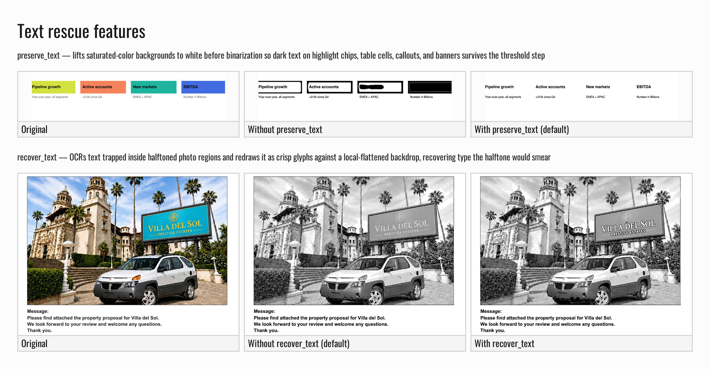

<p align="center">
  
</p>

# PDF FAX — an Agent Skill

<p align="center">
  <a href="https://github.com/petehottelet/pdf-fax-optimizer/releases/latest"></a>
  <a href="LICENSE"></a>
  
  
  
  
  
</p>

A portable [Agent Skill](https://www.anthropic.com/news/skills) that teaches an
AI coding agent to **maximize document quality and readability when sending a
PDF over a fax network.** It converts a PDF into a fax-native **1-bit bilevel
CCITT-G4** PDF (or Class-F multipage TIFF) that survives the lossy Group-3
transmission and **arrives legible on the receiving machine.**

> **A fax's whole job is to be READ.** That is the single most important thing
> about this skill. Fax transmission is low-resolution, 1-bit, and lossy by
> design over a noisy phone line, so this skill optimizes for **legibility on
> the other end first** — crisp text, intact small fonts and signatures,
> recognizable photos. Smaller files and faster transmission are welcome side
> effects, never the goal: a tiny fax that arrives unreadable is a failure.

> **Just need to shrink a PDF for email or the web?** That's a different job with
> the opposite trade-offs — use the companion skill:
> **[pdf-email-optimizer](https://github.com/petehottelet/pdf-email-optimizer)**.

To make a fax legible, the skill models the Group-3 constraint (1-bit,
run-length compression along each scanline) and runs an OCR-driven, layered
pipeline: it renders at the **source's native resolution with square pixels**
(no aspect distortion, no down-scaling), segments image areas, runs OCR over
the page, and recolors **every recognised word's glyphs to SOLID BLACK or SOLID
WHITE by a single bright-line rule — median field luminance vs `#808080`**.
The recoloured glyphs ride a **text layer composited above** the halftoned
image layer, so the screen can never disturb them. It defends fine detail
(background flatten, despeckle, deskew, optional stroke thickening), warns
about content that won't survive bilevel, and lets you **preview exactly what
will be transmitted** with a 4-panel sample sheet so you can confirm it's
readable before sending.

The `SKILL.md` format is an open standard. This skill is built and tested for
**Claude** (Claude Code / claude.ai) and **OpenAI Codex**.

## What it does

- Accepts **PDF, Word, PowerPoint, Excel, OpenDocument, text, and image** input,
  normalizing non-PDF formats to PDF first (see *Input formats* below).
- Rasterizes each page at the **source's native resolution with square pixels**
  — raster sources (PNG, JPG, scans) come through pixel-for-pixel with their
  original aspect ratio; vector sources rasterize square at the
  `--fax-resolution` preset (default **`superfine`**).
- MRC-lite segmentation using the PDF's embedded-image rectangles: photos go to
  halftone, document text goes to an adaptive binarizer, with a guard for
  full-page rasters so the document's own text never gets dithered.
- **OCR-driven text recolor** (default on): `rapidocr-onnxruntime` locates
  every word — outside images (`--ocr-text`) and, with `--recover-text`, inside
  images — and the pipeline marks each word BLACK or WHITE by the **#808080
  rule** (median field luma < 128 → WHITE; ≥ 128 → BLACK). The recoloured
  glyphs ride a layer composited **above** the halftone, so the screen can
  never disturb them.
- Pre-cleans: background flatten, despeckle, deskew; optional stroke thickening
  to save hairlines and small fonts.
- Emits lossless CCITT-G4 (no re-encode) via img2pdf — a `CCITTFaxDecode` PDF or
  a Class-F multipage TIFF, with the (square) effective DPI embedded so the
  output PDF is correctly proportioned.
- `--transmission-safe` clamps the final scanline to 1728 px when you need
  strict Group-3 transmissibility (default keeps native resolution for
  legibility).
- Produces a JSON report with **estimated transmission time per page**, every
  recoloured word and its polarity, and legibility/inversion warnings — plus
  `--sample N` for a labelled contact sheet that goes from 1 panel (preview)
  up to 20 panels (every halftone screen in the registry), all with a settings
  header that documents which options produced the sheet.

## Optimizing for the channel, not "fax-ifying" the document

The goal is to **optimize the document for transmission**, not to make it look
like a generic fax. The skill treats a page as Mixed Raster Content and applies a
*different, selectable schema* to each kind of content:

- **Text / line art** → a contrast-maximizing binarizer (`--text-binarize`,
  default `contrast`; also `sauvola`, `niblack`, `wolf`, `bradley`, `otsu`).
  Text is **never halftoned** — it is thresholded for legibility, pulling gray /
  light-gray text on white to **solid black**, and holding glyphs crisp over dark
  header bars, reverse type, and uneven illumination where a single global cut
  drops light text or fills shadows.
- **Photos / continuous tone** → a **halftone schema** (`--dither`), with
  **dot-gain pre-correction** (`--tone-curve auto`, so midtones don't plug to a
  black silhouette) and optional **edge sharpening** (`--sharpen`).
- **Text baked into an image** (captions, signs, screenshots, or a whole page
  scanned as a single image) → detected *inside* the photo region and routed back
  to the legibility path, so it stays readable instead of dissolving into a
  halftone screen (`--no-text-in-image` to disable). See the next section.

### Text inside images — found, recolored by the #808080 rule, kept legible

Plenty of real fax jobs are full of text that *isn't* live text: a whole page
exported or scanned as a single image, a screenshot, a caption burned into a
photo, a sign in a snapshot. If that page were treated as one big picture and
halftoned, the words would dissolve into dot-screen mud. The pipeline therefore
runs **OCR over every page** and recolors text by a single bright-line rule —
the **#808080 rule** — and never lets the halftone touch a glyph:

1. **Locate every word.** OCR (`rapidocr-onnxruntime`) finds words in two
   scopes: OUTSIDE the image regions (`--ocr-text` — the page's
   header/footer/form text) and, with `--recover-text`, INSIDE the image
   regions (signage, captions). OCR is the locator only; if the engine isn't
   installed the skill falls back to the binarizer's default black-on-white.
2. **Segment the original glyph pixels.** Each word's OCR box is used to crop;
   glyphs are split from their field using the box's border ring (definitely
   field) — robust where a blind 2-means split would invert. The real
   letterforms are preserved; no synthetic font is ever pasted.
3. **Pick polarity per the #808080 rule.** Median field luminance < 128
   ⇒ glyphs become **WHITE**; ≥ 128 ⇒ glyphs become **BLACK**. Polarity is
   decided **per sign** (words grouped by proximity, one field tone for the
   whole group) so co-located words on the same plate get one consistent
   treatment.
4. **Composite text ABOVE the halftone.** The recoloured glyphs ride a text
   layer painted on top of the halftoned image layer, so the halftone screen
   can never disturb them. No field-lift, no field-darken, no stroke backing —
   the layered composite makes those obsolete.

The payoff: **even when an image is aggressively halftoned for transmission,
every word inside it stays legible** — and the report lists each recoloured
word with its OCR confidence, polarity, and field luminance so you can verify.
A `--no-text-in-image` fallback is also available for the rare case where you
want pure halftone everywhere.

### Halftone schemas + the "eye tokens" comparison preview

A continuous-tone photo can't exist in 1-bit fax — it has to be simulated with
dot patterns, and that choice is the biggest lever on how a photo reads after a
lossy transmission. The skill ships these schemas, spanning the design space:

"Detail" is how much fine information the screen carries before the channel
chews on it. "G4 size" is how richly the chosen screen encodes onto the page —
a richer screen leaves more bytes for the modem to ship but renders more of
what the source actually had. "Channel character" is the *kind of trace* the
screen leaves on the line: long-run AM strokes survive line noise cleanly,
fine-grain FM stipple holds photographic detail, error-diffusion families
diffuse tone with their own signature. None of these is "best" in isolation —
the right pick depends on what's on the page.

| `--dither` | Family | Detail | G4 size | Channel character |
|---|---|---|---|---|
| `clustered` | AM screening — round clustered-dot | low–med | minimal | long-run, line-tolerant |
| `screen --dot-shape square` | AM screening — square dot | low–med | minimal | long-run, line-tolerant |
| `screen --dot-shape diamond` | AM screening — diamond dot (newspaper-photo classic) | low–med | minimal | long-run, line-tolerant |
| `screen --dot-shape ellipse` | AM screening — ellipse dot (smooth midtone joins) | low–med | minimal | long-run, line-tolerant |
| `mezzotint` | AM grain — random stippling (expressive; not eligible for `auto`) | med | rich | stippled grain, decorative |
| `ordered` | Bayer ordered (matrix dither) | med | med | regular matrix, predictable |
| `blue-noise` | FM screening (void-and-cluster) | **high** | medium | isotropic fine-grain stipple |
| `green-noise` | hybrid AM–FM (clustered FM) | med–high | low–med | hybrid stipple/cluster — balanced |
| `floyd` | error diffusion (4-tap Floyd-Steinberg) | **highest** | rich | fine-grain, detail-first |
| `atkinson` | error diffusion (6/8 Atkinson, clean whites) | high | med | sparse stipple, clean whites |
| `jarvis` | error diffusion (12-tap Jarvis-Judice-Ninke, very smooth) | high | rich | diffuse, smooth-tone |
| `stucki` | error diffusion (12-tap Stucki, sharp + smooth) | high | rich | diffuse, sharp + smooth |
| `sierra` | error diffusion (12-tap Sierra, lighter Jarvis) | high | rich | diffuse, soft-tone |
| `edd` | edge-enhancing error diffusion (high-pass + diffusion) | high | med | edge-enhancing, type-friendly |
| `line` (`woodcut`) | horizontal line screen (engraving) | med | minimal | scanline-aligned stripes |
| `crosshatch` | layered angled line screens (pen-and-ink etching) | med | low–med | angled strokes, etching |
| `none` | hard threshold (no halftone) | — | minimal | hard-edge, no halftone |

`green-noise` is the standout for a balanced fax line — blue-noise detail with
clustered-dot run-length, tunable via `--green-noise-coarseness` (~2 detail … 8
robust) — and it's the auto-picker's fallback when no other signal dominates.
But the picker isn't single-track: it now reads cheap content stats (mean/std
luma, edge density, bimodality, texture) off the photo regions and chooses from
`{clustered, atkinson, edd, floyd, jarvis, green-noise}` based on what's
actually on the page — `edd` for text overlaid on a photo, `atkinson` for dark
high-contrast images, `floyd` for fine-detail texture, `jarvis` for smooth
gradients, `clustered` for true 2-tone posters. The picked dither plus the
feature stats that drove it are surfaced in the `--report` JSON so you can see
WHY a page chose what it chose. `line`/`woodcut` renders tone as horizontal
stripes that thicken with darkness — because the strokes run *along the
scanline* it's the most G4-friendly way to carry a photo and reads as a clean
engraving, never mud. Because the pipeline runs at square pixels, the screens
are isotropic by construction — dots stay round on paper without any
anisotropic correction. `mezzotint` is an expressive screen — velvety midtones
but no spatial coherence, so it compresses richly and isn't eligible for the
auto-picker; it has to be requested explicitly.

Every screen in the registry, applied to the same letter cover sheet —
**`floyd`, `jarvis`, and `edd` are highlighted as the OPTIMAL picks** for a
forms-and-photo page like this one (preserve fine document text, hold
photographic detail in the masthead, keep edge sharpness on the billboard):

<p align="center">
  
</p>

That grid above is the whole catalogue. For picking by eye on your own document
you don't need all 17 — compression can be ranked by a machine, but **readability
can't**, and you can't read 17 thumbnails in parallel. So `--sample N --panels K`
renders one page of your file through K side-by-side panels into a single
labelled **contact sheet**, each panel annotated with its real G4 size and
transmission estimate and the recommended pick highlighted. The skill
**suggests the optimal** method from the page's content, and you **choose the
optimal** by spending your *eye tokens* on the contact sheet — then re-run
with the chosen `--dither` for the final file.

```bash
# Default 4-panel: original / grayscale / default fax (Otsu) / auto-pick
python pdf-fax-optimizer/scripts/optimize_pdf.py input.pdf -o output.fax.pdf \
    --sample 1

# Minimal 2-panel: original + Claude's auto-picked optimal
python pdf-fax-optimizer/scripts/optimize_pdf.py input.pdf -o output.fax.pdf \
    --sample 1 --panels 2

# Curated 6-up — same layout the old `--compare-page` shipped
python pdf-fax-optimizer/scripts/optimize_pdf.py input.pdf -o output.fax.pdf \
    --sample 1 --panels 6

# Full catalogue on your own page: every screen in the SCREENS registry,
# laid out exactly like halftone_grid.png above but for YOUR document
python pdf-fax-optimizer/scripts/optimize_pdf.py input.pdf -o output.fax.pdf \
    --sample 1 --panels max

# Power-user custom recipe
python pdf-fax-optimizer/scripts/optimize_pdf.py input.pdf -o output.fax.pdf \
    --sample 1 --sample-include orig,gray,clustered,floyd,line
```

`--panels K` supports 1, 2, 4 *(default)*, 6, 8, 12, 20 *(`max`)*. Every panel
count is a strict superset of the smaller ones, so it's a clean detail-dial.
Every contact sheet carries a 3-line **settings header** at the top documenting
the exact options that produced it (preserve_text, ocr_text, recover_text,
text_binarize, dither, transmission_safe, the auto-pick recommendation, and
the page's photo fraction) — so saved sheets stay self-documenting weeks
later. Add `--no-sample-header` to omit it. The old `--compare-page` and
`--preview-page` flags still work for backward compatibility.

### Text That Survives the Fax

Two layered passes protect text against the 1-bit channel. Both are on by
default and the report lists everything they touched so you can verify.

**`preserve_text` — dark text on any colored fill (no OCR needed).** Slide
labels on highlight chips, dashboard status badges, colored table cells,
tinted callout boxes, color-filled banners — anywhere dark text sits on a
saturated-colour background. In grayscale those fills collapse to mid-tone
luma and the contrast binarizer flips polarity, painting the fill solid
black and knocking the label out as a mangled crosshatch. The `preserve_text`
pass runs ahead of the binarizer: small high-chroma regions that carry dark
text strokes get **lifted to white in the gray image** so the dark text reads
as crisp black-on-white. Disable with `--no-preserve-text`.

**`recover_text` — OCR-driven #808080 polarity for text inside photos.** OCR
locates every word inside the photo region; each word's ORIGINAL glyph pixels
are recoloured BLACK on a light/mid field or WHITE on a dark field by the
#808080 rule, then composited **above** the halftone so the screen never
disturbs them. Opt in with `--recover-text on`.

<p align="center">
  
</p>

### Verify exactly what was changed (`--report`)

Every run can emit a JSON report (`--report out.report.json`) listing what the
pipeline decided per page — the halftone screen it chose, the estimated
transmission seconds, every legibility warning, and **every word the OCR-driven
passes recoloured** with its polarity, the field-luma the polarity was decided
against, and the WCAG contrast it landed at. That makes the layered text passes
auditable rather than magic: open the report, search for any word in the
document, see precisely which polarity it carried and why.

<details>
<summary><strong>Example excerpt</strong> — one page, abbreviated</summary>

```json
{
  "mode": "fax",
  "input": "Prestige_Estates_v3.pdf",
  "output": "Prestige_Estates_v3.fax.pdf",
  "input_bytes": 603870,
  "output_bytes": 492627,
  "pages": [
    {
      "index": 1,
      "encoded_bytes": 492050,
      "est_transmission_s": 274.9,
      "photo_regions": 1,
      "photo_fraction": 0.2948,
      "dither": "green-noise",
      "text_binarize": "contrast",
      "already_bilevel": false,
      "ocr_text": {
        "scope": "doc",
        "engine": "rapidocr-onnxruntime",
        "words_recognized": 184,
        "words_recolored_black": 174,
        "words_recolored_white": 10,
        "words": [
          { "text": "Prestige",   "conf": 0.987, "polarity": "white",
            "rendered": true,  "field_gray":  42.0, "wcag_contrast": 12.1,
            "bbox": [120, 88, 412, 156] },
          { "text": "Investor",   "conf": 0.974, "polarity": "black",
            "rendered": true,  "field_gray": 248.0, "wcag_contrast": 16.4,
            "bbox": [120, 252, 388, 296] }
          /* …182 more words… */
        ]
      },
      "recover_text": {
        "scope": "image",
        "engine": "rapidocr-onnxruntime",
        "words_recognized": 7,
        "words_recolored_black": 0,
        "words_recolored_white": 7,
        "words": [
          { "text": "VILLA",      "conf": 0.992, "polarity": "white",
            "rendered": true,  "field_gray":  88.4, "wcag_contrast":  9.8,
            "bbox": [1042, 612, 1304, 692] },
          { "text": "DEL",        "conf": 0.988, "polarity": "white",
            "rendered": true,  "field_gray":  91.2, "wcag_contrast":  9.4,
            "bbox": [1310, 612, 1416, 692] },
          { "text": "MAR",        "conf": 0.985, "polarity": "white",
            "rendered": true,  "field_gray":  90.6, "wcag_contrast":  9.5,
            "bbox": [1424, 612, 1572, 692] }
          /* …4 more words… */
        ]
      },
      "warnings": ["text_preserved:395kpx"]
    }
  ],
  "total_est_transmission_s": 274.9,
  "warnings": ["text_preserved:395kpx"]
}
```

Read this as: *page 1 was halftoned with `green-noise`, will take ~275 seconds
to transmit at G3 superfine, and the OCR-driven recolor pass touched **191
words**. Of those, **184 outside the photo** were recoloured by the
`--ocr-text` polarity rule (174 BLACK on light fields, 10 WHITE on dark header
bars), and **7 inside the photo** were recoloured WHITE by `--recover-text`
because they sit on the dark billboard with `field_gray ≈ 90` (< 128, so the
#808080 rule paints them WHITE).*

The `warnings` array uses short greppable keys: `text_preserved:Nkpx` (preserve-text
pass lifted N thousand pixels), `inverted_or_heavy_black` (>45 % of the output is
black ink — likely an inverted page), `wash_out_color:light` (light-yellow / pale
hues that won't survive bilevel), and `expressive_screen:mezzotint` (you asked
for a screen that compresses poorly — flagged honestly).

</details>

## Input formats — fax a PDF, or a Word, PowerPoint, Excel, or image file

You don't have to start from a PDF. Point the optimizer at common office and
image formats and it normalizes them to PDF first, then runs the exact same
fax pipeline:

- **Word / OpenDocument / text** — `.doc`, `.docx`, `.rtf`, `.odt`, `.txt`
- **PowerPoint** — `.ppt`, `.pptx`, `.odp`
- **Excel / CSV** — `.xls`, `.xlsx`, `.ods`, `.csv`
- **Images** — `.png`, `.jpg`, `.tif`, `.bmp`, `.gif`, `.webp`
- **PDF** — used as-is

```bash
# Fax a Word doc directly (defaults: superfine + OCR-driven #808080 polarity)
python pdf-fax-optimizer/scripts/optimize_pdf.py proposal.docx -o proposal.fax.pdf

# Fax a scanned image with a 4-panel sample sheet
python pdf-fax-optimizer/scripts/optimize_pdf.py scan.jpg -o scan.fax.pdf --sample 1
```

Images are wrapped to PDF with `img2pdf` (no extra tools). Office/OpenDocument
files are rendered by **LibreOffice headless** (`soffice`), which reproduces the
layout faithfully — install [LibreOffice](https://www.libreoffice.org/download/)
once (it needs no GUI) or export to PDF yourself. Add `--keep-converted-pdf` to
retain the intermediate PDF next to the output.

## Repository layout

```
.
├── README.md              # this file (for humans)
├── LICENSE                # MIT
├── requirements.txt       # Python deps
└── pdf-fax-optimizer/         # the skill (this folder IS the skill)
    ├── SKILL.md           # entry point: metadata + instructions
    ├── agents/
    │   └── openai.yaml     # optional Codex UI sidecar
    ├── assets/
    │   ├── bluenoise_64.npy       # cached void-and-cluster blue-noise matrix
    │   ├── greennoise_64_s4.0.npy # cached green-noise (clustered FM) matrix
    │   └── Oswald.ttf             # bundled display font for the comparison title
    ├── scripts/
    │   ├── check_deps.py   # verify/install dependencies
    │   ├── optimize_pdf.py # CLI entry point (optimize, and optionally --send)
    │   ├── fax_pipeline.py # the fax conversion pipeline
    │   ├── to_pdf.py       # normalize Office/image input to PDF
    │   └── send_fax.py     # transmit via a cloud fax API (mFax/Phaxio/generic)
    └── references/
        ├── fax-optimization.md  # the Group-3 model + why each knob exists
        ├── config-schema.md     # JSON config schema + examples
        └── sending.md           # send via a cloud fax API
```

## Requirements

- **Python 3.10+** with: PyMuPDF, Pillow, numpy, opencv-python-headless, img2pdf
  (`pip install -r requirements.txt`). `requests` is also installed, needed only
  to **send** faxes.
- **`rapidocr-onnxruntime`** (optional but recommended) — drives the OCR-based
  #808080 polarity passes (`--ocr-text` and `--recover-text`). Self-contained
  (bundled ONNX models, no system OCR binary). Without it the skill still
  works: document text falls back to the binarizer's default black-on-white
  and the within-image recover pass is silently skipped.
- **No CLI tools required** for PDF/image input. (qpdf / Ghostscript are optional
  and only useful for unrelated PDF work.)
- **LibreOffice** (optional) — only needed to fax **Office/OpenDocument** input
  (Word/PowerPoint/Excel); it runs headless, no GUI.

Let the skill bootstrap the Python side:

```bash
python pdf-fax-optimizer/scripts/check_deps.py   # installs missing pip deps
```

## Installing the skill

`SKILL.md` is the open standard; the only difference between agents is **where**
the skill folder lives. Copy the `pdf-fax-optimizer/` folder into the appropriate
location:

| Agent | Location (user-level) | Location (project-level) |
|---|---|---|
| **Claude Code** | `~/.claude/skills/pdf-fax-optimizer/` | `.claude/skills/pdf-fax-optimizer/` |
| **OpenAI Codex** | `~/.codex/skills/pdf-fax-optimizer/` | `.agents/skills/pdf-fax-optimizer/` |

**Easiest** — grab the packaged skill from the
**[latest release](https://github.com/petehottelet/pdf-fax-optimizer/releases/latest)**
(`pdf-fax-optimizer.zip`) and unzip it directly into one of the locations above:

```bash
# Claude Code (user-level)
curl -L -o pdf-fax-optimizer.zip \
  https://github.com/petehottelet/pdf-fax-optimizer/releases/latest/download/pdf-fax-optimizer.zip
unzip pdf-fax-optimizer.zip -d ~/.claude/skills/
```

Or clone the repo and copy the inner skill folder into place:

```bash
git clone https://github.com/petehottelet/pdf-fax-optimizer.git
# Claude Code
cp -r pdf-fax-optimizer/pdf-fax-optimizer ~/.claude/skills/pdf-fax-optimizer
# OpenAI Codex
cp -r pdf-fax-optimizer/pdf-fax-optimizer ~/.codex/skills/pdf-fax-optimizer
```

**Claude Code** discovers skills automatically (no restart) and you can invoke
with `/pdf-fax-optimizer`. For **claude.ai** (web/desktop), zip the `pdf-fax-optimizer/`
folder so the folder is the archive root, then upload it under
Settings → Capabilities → Skills:

```bash
cd pdf-fax-optimizer && zip -r pdf-fax-optimizer.zip pdf-fax-optimizer
```

**OpenAI Codex** keeps skills behind an experimental flag — enable it once, then
restart Codex:

```toml
# ~/.codex/config.toml
skills = true
```

Codex activates the skill implicitly when your request matches the description,
or explicitly via `$pdf-fax-optimizer`. (Codex caps the frontmatter `description` at
500 characters — this skill's description is within that limit.)

## Using it directly (without an agent)

The scripts are a normal CLI:

```bash
# Make a PDF faxable (default: superfine, native res, OCR + #808080 on)
python pdf-fax-optimizer/scripts/optimize_pdf.py input.pdf -o output.fax.pdf \
    --report output.report.json --sample 1

# Compare halftone methods side-by-side and pick by eye (6-up, 12-up, max…)
python pdf-fax-optimizer/scripts/optimize_pdf.py input.pdf -o output.fax.pdf \
    --sample 1 --panels 6

# Strict Group-3 transmissibility (1728-px scanline) for a real fax machine
python pdf-fax-optimizer/scripts/optimize_pdf.py input.pdf -o output.fax.pdf \
    --transmission-safe

# Multipage Class-F G4 TIFF instead of a PDF
python pdf-fax-optimizer/scripts/optimize_pdf.py input.pdf -o output.tiff \
    --format tiff
```

See `pdf-fax-optimizer/references/config-schema.md` for the full flag/config
reference, and `pdf-fax-optimizer/references/fax-optimization.md` for the reasoning
behind the fax defaults.

## Sending the fax via a cloud API

The skill can also **transmit** the optimized file — no machine, modem, or phone
line, just an API key and the recipient number in **E.164**. Built-in providers:
`mfax` (mFax/Documo), `phaxio` (Phaxio/Sinch), and `generic` (any upload API such
as Telnyx or SRFax). Always pass keys via environment variables, and use
`--dry-run` to preview the exact request first.

```bash
export MFAX_API_KEY=sk_live_xxx

# optimize and send in one step (transmission-safe for real fax lines)
python pdf-fax-optimizer/scripts/optimize_pdf.py input.pdf -o output.fax.pdf \
    --transmission-safe \
    --send mfax --to +14155551234 --dry-run     # drop --dry-run to transmit

# or send an already-optimized file
python pdf-fax-optimizer/scripts/send_fax.py output.fax.pdf \
    --provider phaxio --to +14155551234
```

See `pdf-fax-optimizer/references/sending.md` for per-provider endpoints, auth, env
vars, and configuring `generic` for other APIs.

## License

MIT — see [LICENSE](LICENSE).
